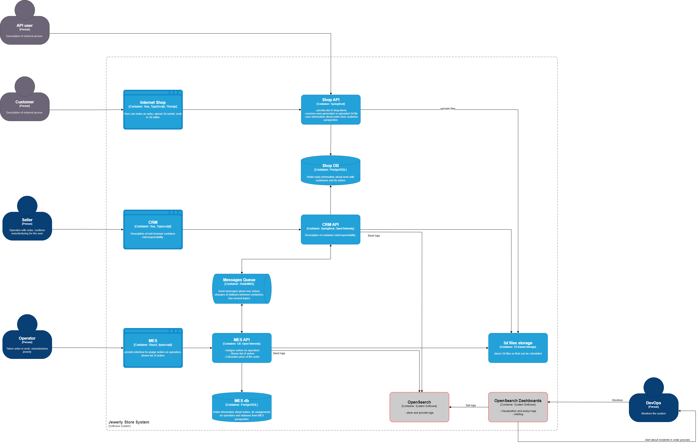

Архитектурное решение по логированию

# 1 Анализ

В настоящее время наблюдаются проблемы с обработкой заказов. Отсутствие настроенного логирования не позволяет определить как выполняются процессы в сервисе: какие операции выполняется, в каких операциях возникают ошибки, какие типы у ошибок, при каких условиях возникли ошибки и прочие сведения.

Одной из причин "потери" заказов в процессе обработки могут быть ошибки в сервисах. 

Потребуется настроить логирование, чтобы получить информацию о том, что происходит в сервисах:

- `Логирование уровня INFO`
  - Логировать сведения о действиях клиентов в сервисе Online Shop: результат запроса, идентификатор пользователя, время выполнения запроса и т.п.
  - Логировать сведения о действиях клиентов в сервисе MES API
  - Логировать сведения об операциях процесса обработки заказов: 
    - название сервиса
    - название процесса
    - название обработчика/операции
    - дате и времени начала и завершения операции
    - идентификаторе пользователя, вызвавшего операцию (если применимо) 
    - идентификаторе заказа
    - событии смены статуса (если применимо)

- `Логирование уровня WARNING`
  - Логировать попытки неавторизованных доступов: ip, идентификатор пользователя, если применимо, сведение о запрашиваемом ресурсе и т.п.

- `Логирование уровня ERROR`
  - Обязательно логировать сведения об инцидентах: метку времени ошибки, стектрейс, информацию об операции и обрабатываемом объекте

В целом для полноценности сведений необходимо покрыть логированием все процессы во всех сервисах. Для этого требуется определить процессы, описать их и продумать какие логи необходимо фиксировать.

# 2 Мотивация

## 2.1 Почему нужно логирование

Логи отображают происходящие внутри системы процессы в реальном времени и содержат сведения об операциях с заложенной при проектировании/реализации детализацией, в том числе детальную информацию об ошибках. При разборе инцидентов по данным сведениям получается установить операции и объекты, в которых возникли ошибки, вплоть до участков в коде.

Сбор логов в централизованном хранилище позволит настроить алертинг на события  (в том числе на ошибки), возникающие в процессе обработки объектов системы, и уведомит об этих событиях ответственные лица.

Таким образом: 
- Логирование фиксирует сведения о процессах внутри сервиса и при возникновении ошибок служит источником данных для анализа и установления причин. 

- Настроенный алертинг при возникновении ошибок оповестит ответственных за процесс и/или создаст задачу на исследование инцидента. Это позволит оперативно реагировать на ошибки, выявлять причины ошибок и предпринять меры для устранения ошибок.

Внедрение логирования повлияет на такие метрики как:

- `Время на диагностику (Mean Time to Diagnose, MTTD)` - среднее время, необходимое для диагностики инцидента

- `Время восстановления после сбоя (Mean Time to Recovery, MTTR)` - среднее время, необходимое для восстановления системы после инцидента

- `Время до разрешения проблемы (Time to Resolution)` - среднее время, необходимое для решения заявок клиентов

- `Частота инцидентов (Incident Frequency)` - количество инцидентов или сбоев за определенный период

## 2.2 Приоритеты

В настоящее время требуется решить проблему обработки заказов, с учетом ограничений и возможностей команды.
Покрывать трейсингом и логами все сервисы и процессы сразу не требуется, но нужно будет обязательно реализовать трейсинг и логирование процесса обработки заказов в сервисах MES и CRM.
Данные сервисы на разных стеках, поэтому задачи можно будет распараллелить между разработчиками .NET и Java.

Начать следует с логирования, так как в процессе участвует не так много сервисов. Без трейсов будет сложнее проследить процесс обработки Заказа, но это все еще будет возможно на основании анализа логов. 

Логи смогут также предоставить сведения об ошибках. Поэтому уровень логирования ERROR необходимо включить во всех сервисах, чтобы была информация о возникающих ошибках: когда и где.

## 2.2.3 Задачи

#### Задача 1.1 Devs:

Необходимо в сервисах MES и CRM включить логирование на уровне фреймворков в консоль, а также реализовать включение логирования через конфиги.

#### Задача 1.2 DevOps:

Параллельно начать развертывание инфраструктуры и сервисы для сбора и хранения логов, так как сведения из логов уже могут послужить источником информации для диагностики проблем

#### Задача 2.1 Devs:

Реализация логирования процесса обработки заказов

#### Задача 2.2 DevOps:

Разворачивание дашбордов и реализация POC алертов

#### Задача 3.1 Devs:

Подключение трейсинга в проекте и реализация POC

#### Задача 3.2 DevOps:

Параллельно начать развертывание инфраструктуру для Jaeger, а в качестве хранилища для трейсов использовать сервис хранения логов

#### Задача 4.1 Devs:

Реализация трейсинга процесса обработки заказов: по идее реализовать трейсинг в тех же компонентах, в которых было настроено логирование 

#### Задача 4.2 DevOps:

Настроить Jaeger, дашборды, алерты

# 4 Предлагаемое решение

## 4.1 Требуемые изменения

Для внедрения логирования будет развернут стек OpenSearch. Для этого потребуется добавить следующие компоненты:
OpenSearch - для сбора и хранения логов
OpenSearch Dashboards - для визуализации и настройки алертов

Потребуется доработать сервисы MES и CRM в компонентах, отвечающих за процесс обработки заказов.

## 4.2 Политика безопасности в отношении логов

- Функционал для работы с логами должен быть доступен только внутри контура.
- Доступ к логам должен быть только у DevOps. 
- Предоставление логов сервиса должно согласовываться с ИБ.
- В логи не должны попадать токены доступов, ПДн, секреты и прочая чувствительная информация

## 4.3 Политика хранения в отношении логов

- Под каждый сервис требуется настроить отдельный индекс, с временем хранения один месяц.

## 4.4 Меры по трансформации в систему анализа логов

- Для реализации алертов помимо настройки OpenSearch DashBoards или Grafana, может потребоваться доработка кода с целью генерации определенных событий, по которым будет происходить алерты. Например кастомные ошибки или записи по определенном паттерну.
Также необходимо настроить каналы куда будут приходить оповещения о событиях. 

- Логи о взаимодействии клиентов с системой можно использовать для анализа инцидентов ИБ, а также выявления аномалий, которые могут быть признаками атак, направленных на отказ оборудования, детектирования брутфорса и т.п. Для такого анализа может потребоваться внедрение SIEM-системы.

- Логи послужат источником данных для проведения ретроспективного анализа

## 4.5 Выбор технологии

|Критерий|Вес|OpenSearch|ELK       |Лучший выбор|Комментарий|
|--------|---|----------|----------|-----|-----------|
|Лицензия|2|Apache 2.0|Двойная лицензия SSPL и Elastic License 2.0 (ELv2)||Так как не планируется предоставлять ELK как сервис в коммерческих целях, то по идее можно использовать бесплатную версию|
|Стоимость|3|Вся функциональность доступна полностью бесплатно|Полная функциональность платная|OpenSearch||
|Функции безопасности|3|RBAC, шифрование, аудит, TLS/SSL, встроенная аутентификация и авторизация|TLS/SSL, встроенная аутентификация и авторизация||Бесплатная версия ELK покрывает потребности|
|Основной инструмент визуализации|1|OpenSearch Dashboards - форк Kibana. Полностью бесплатный|Kibana. Не весь функционал доступен в бесплатной версии||Можно использовать сторонние средства визуализации|
|Алертинг|3|Есть|Доступен в платной версии|OpenSearch||
|Развитие|2|Open Source. Поддерживается Linux Foundation|Развивается Elastic.co, с приоритетом на коммерческое использование|OpenSearch||

По наиболее важным критериям самый оптимальный вариант - это использовать OpenSearch.

