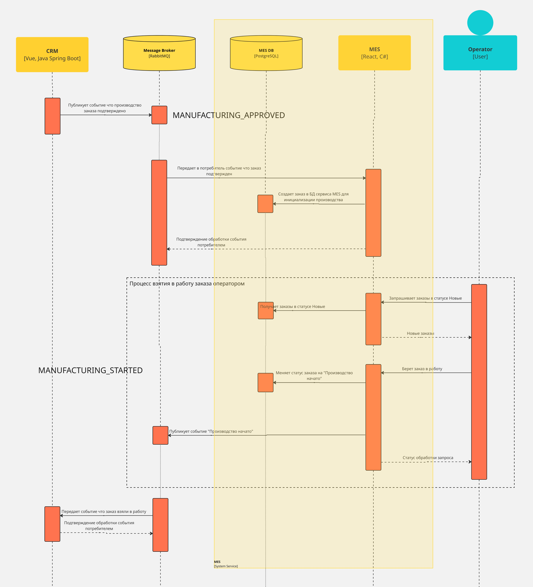
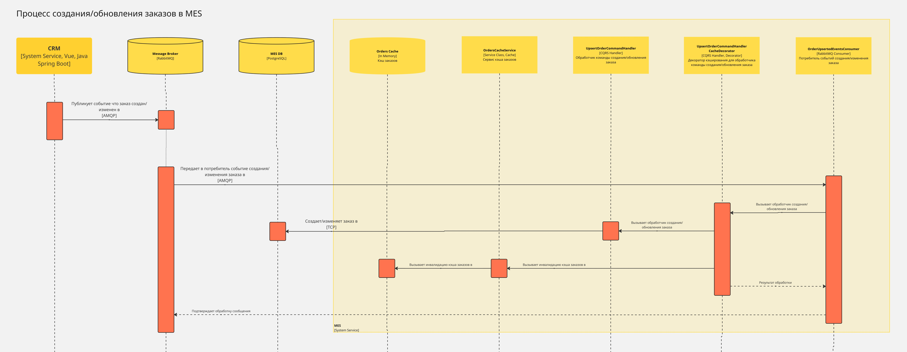
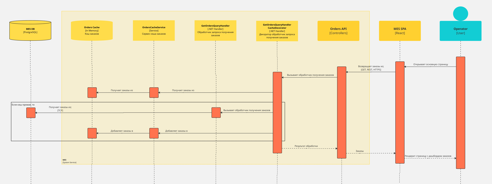
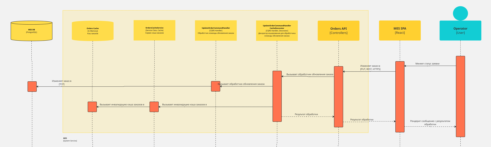

Архитектурное решение по кэшированию

# 1 Анализ

На текущий момент наблюдаются проблемы с производительностью функционала работы операторов с заказом. Никакого кэширование в системе не реализовано. Для операторов важно получать актуальные заказы в статусе Новая.
Кэширование результатов выполнения "тяжелых" SQL запросов в сервисе MES, снизит нагрузку на БД и улучшит отклик для всех операторов, так как для каждого запроса будут возвращаться данные из кэша.
При проработке решения стоит учитывать, что в дашборде Заказов реализован пейджинг и фильтрация по статусам. 

# 2 Мотивация

Кэширование улучшит отклик функционала работы операторов с заказами. Тем самым кэширование решит существующую проблему. Его относительно дешево и достаточно быстро можно реализовать и внедрить.

# 3 Предлагаемое решение

## 3.1 Выбор кэширования

Потребуется серверное кэширования, потому что необходимо будет инвалидировать кэш после поступления новых заказов или изменения статуса заказа. Это обусловлено тем, что для операторов важно получать самые новые заказы.

### 3.1.1 Выбор решения медленной загрузки

С учетом пейджинга и фильтрации по статусам есть следующие решения проблемы медленной загрузки страницы заказов для работы операторов

|                      |Решение 1|Решение 2|
|----------------------|---------|---------|
|Описание              |Кэшировать страницы заказов, используя в качестве ключа комбинацию статуса и номера страницы|Кэшировать все заказы с реализацией пэйджинга на уровне приложения|
|Применимые паттерны   |Read-Through, Cache-Aside|Read-Through, Cache-Aside, Write-Trough|
|Применимые стратегии инвалидации|- На изменение  - Программная|- Для Read-Through, Cache-Aside - на изменение;  - Для Read-Through+Write-Trough - не требуется, так как элементы кэша обновляются по ключу|
|Преимущества          |- просто реализовать  - есть возможность трансформировать во второе решение, поменяв ключи и доработав логику|- требуется выполнить один медленный запрос для получения всех заказов из БД|
|Недостатки            |- переход на новую страницу попадет в кэш промах и потребуется выполнить медленный запрос для получения заказов новой страницы|- потребуется дополнительно реализовать логику пейджинга и фильтрации на стороне сервиса  - все заказы в кэше|
|Итого                 |Простое решение. При необходимости недостаток можно нивелировать реализацией прогрева кэша.   'Примечание': хоть реализация прогрева кэша это дополнительная задача, усложняющая логику, но выработанное решение и подходы можно будет переиспользовать в дальнейшем|Реализация логики пейджинга и фильтрации требует дополнительных изменений и ведет к усложнению реализации|

Наиболее оптимальный вариант - это реализовать решение 1.

`Примечание`: есть также решение, при котором на фронтенд будет возвращаться весь список заказов, а пейджинг и фильтрация будут происходить на фронте. Тогда можно использовать решение 2 с кэшированием всего списка заказов. Но это все еще решение, которое требует достаточно значительных изменений.

### 3.1.2 Выбор паттерна кэширования

|            |Read-Through|Cache-Aside|
|------------|------------|-----------|
|Преимущества|- можно реализовать вынести в отдельный сервис   - сервис кэша использует собственные ресурсы   - делегирование управления кэшэм на сам сервис кэша   - есть готовые решения|- просто реализовать посредством декорирования, не внося изменения в существующую логику   - есть готовые решения для реализации in-memory   - кэш будет хранить готовое представление заказа, требуемое на фронте|
|Недостатки  |- потребуется внести изменения в текущую логику, заменив логику работы с БД на клиент работы с кэшем   - потребуется развертывать и сопровождать еще один сервис|- использует ресурсы сервиса|
|Итого       |Требует значительных дополнительных изменений и вложений|Оптимальный вариант, так как достаточно дешево и быстро можно внедрить и проверить результат от добавления кэша. Остается возможность заменить на распределенный кэш с минимальными затратами|

Таким образом наиболее оптимальное решение текущей проблемы с минимумом изменений - это реализация Cache-Aside паттерна с in-memory реализацией.

## 3.2 Диаграмма последовательности

### 3.2.1 Процесс создания и обработки Заказов в сервисе MES. AS IS

### 3.2.1 Процесс создания и обработки Заказов в сервисе MES.
#### 3.2.1.1 Создание заказа в сервисе MES

#### 3.2.1.2 Получение заказов для страницы операторов

#### 3.2.1.3 Изменение статуса заказа оператором

## 3.3 Стратегия инвалидации кэша

### 3.3.1 Неподходящие стратегии инвалидации
|Стратегия инвалидации |Почему не подходит?|
|----------------------|-------------------|
|Временная             |Не подходит, так как операторы должны получать актуальные данные|
|Основанная на запросах|Не подходит, так как надо реализовать локальный кэш для каждого оператора и вызывать инвалидацию в каждом из них|
|По ключу              |Не применима, так как в качестве ключа используются статус заказа и номер страницы|

### 3.3.2 Выбор стратегии инвалидации

|Критерий    |На основе изменений|Программная|
|------------|-------------------|--------------------|
|Преимущества|- Просто реализовать|- Изменяем только то что требуется|
|Недостатки  |- вызов инвалидации потребует заново выполнить медленный запрос к БД|- с учетом пейджинга и фильтрации по статусам потребует реализации сложного механизма инвалидации с учетом старых и новых статусов. Данное решение может быть слишком сложным, если вообще адекватно реализуемым, а польза весьма сомнительной|
|Итого       |Оптимальный и фактически единственный вариант, который подходит с учетом существующих ограничений и особенностей логики|Реализуемый вариант, но с учетом ограничений и особенностей логики - неадекватно сложный и с минимумом пользы|

С учетом выбранного паттерна Cache-Aside и сохранением текущей логики пейджинга и фильтрации по статусам наиболее оптимальный вариант это использовать стратегию инвалидации на основе изменений.
